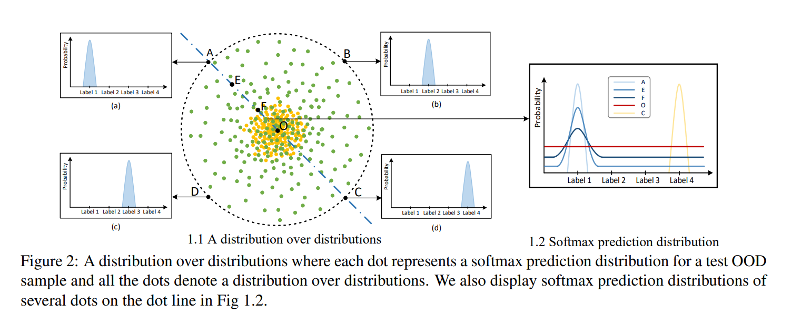
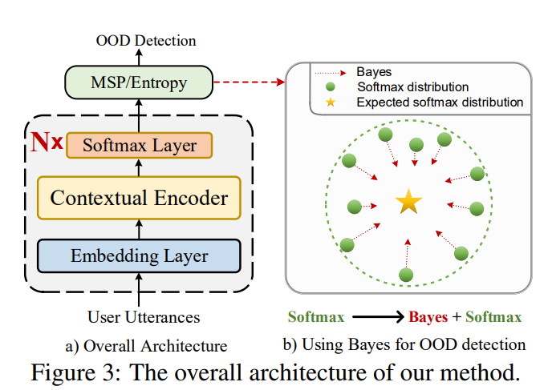

# Distribution Calibration for Out-of-Domain Detection with Bayesian Approximation


This repository is the official implementation of Bayesian OOD detection method: [Distribution Calibration for Out-of-Domain Detection with Bayesian Approximation](https://aclanthology.org/2022.coling-1.50/) **(COLING2022)** by [Yanan Wu](https://aclanthology.org/people/y/yanan-wu/), [Zhiyuan Zeng](https://aclanthology.org/people/z/zhiyuan-zeng/), [Keqing He](https://aclanthology.org/people/k/keqing-he/), [Yutao Mou](https://aclanthology.org/people/y/yutao-mou/), [Pei Wang](https://aclanthology.org/people/p/pei-wang/), [Weiran Xu](https://aclanthology.org/people/w/weiran-xu/).


# Introduction

We propose a Bayesian OOD detection framework to calibrate distribution uncertainty using Monte-Carlo Dropout.

An example about a distribution over distributions on a simplex



The overall artitecture of our method :



# Dependencies

We use anaconda to create python environment:

`conda create --name python=3.6`

Install all required libraries:

`pip install -r requirements.txt`

# How to run

1. Training with Cross-entropy Loss  
```sh run.sh 0```


2. Testing with MSP  
 ``sh run.sh 1``
 
3. Training with Cross-entropy Loss and testing with MSP  
 ``sh run.sh 2``
 
3. Testing with MSP plus Bayes  
 ``sh run.sh 3``


# Parameters

The parameters that must be specified:

- `dataset`, required, The dataset to use, CLINC_OOD_full, ATIS, SNIPS... 
- `mode`, optional, specify running mode, options: 
    - `train`: only train model
    - `test`: only predict the model with trained model
    - `both`: train model, and use the trained model to predict
- `detect_method`, required when the mode is 'test' or 'both', specify the settings to detect ood samples, options:
    - `msp`
    - `gda`
    - `lof`
    - `Entropy`
- `model_dir`, required when the mode is 'test', specify the directory contains model file 
- `unseen_classes`, oos
- `ce_pre_epoches`, 200

The parameters that have default values (In general, it can stay fixed):

- `gpu_device`, default = 1
- `output_dir`, default = ./outputs
- `embedding_file`, default = /glove/glove.6B.300d.txt
- `embedding_dim`, default = 300
- `max_seq_len`, default = None,
- `max_num_words`, default = 10000
- `max_epoches`, default = 200
- `patience`, default = 20
- `batch_size`, default = 200
- `seed`, default = 2022
- `train_class_num`, default = n 

The parameters that realted to Bayes:
- `mc_dropout`,whether to use MC dropout or not, value = True
- `mc_round`, Rounds of MC dropout, value = 0.7
- `mc_pro`, Rounds of MC dropout probability, value = 100

# Code Introduction by block 

## 1. model.py

- BiLSTM_LMCL main model
- LMCL Loss

## 2. train.py

Model main experiment, including:

- Process Data
- Select OOD type randomly or specify OOD type
- Train model(BiLSTM + LSTM)
- Predict model
    

## 3. utils.py

- **get_score**, get f1, f1_seen, f1_unseen result according to the confusion matrix
- **confidence**, calculate mahalanobis or euclidean distance based on the confidence of each category
- **get_test_info**, get predicting results including text,label,softmax probability, softmax prediction,softmax confidence,(if use lof) lof prediction result,(if use gda) gda mahalanobis distance, (if use gda) the gda confidence
- **log_pred_results**, Read'. / output_dir... /result.txt' file, print the result in the specified format, and convert it to the 'results.json' file.

# Results
<table>
       <tr  align="center">
        <td><b></b></td>
        <td><b></b></td>
        <td colspan="6"><b>CLINC-Full</b></td>
        <td colspan="6"><b>CLINC-Imbal</b></td>
       </tr>
       <tr  align="center">
        <td><b></b></td>
        <td><b></b></td>
        <td colspan="2"><b>OOD</b></td>
        <td colspan="2"><b>IND</b></td>
        <td colspan="2"><b>OOD</b></td>
        <td colspan="2"><b>IND</b></td>
       </tr>    
       <tr  align="center">
        <td><b></b></td>
        <td><b></b></td>
        <td colspan="1"><b>F1</b></td>
        <td colspan="1"><b>Recall</b></td>
        <td colspan="1"><b>F1</b></td>
        <td colspan="1"><b>ACC</b></td>
        <td colspan="1"><b>F1</b></td>
        <td colspan="1"><b>Recall</b></td>
        <td colspan="1"><b>F1</b></td>
        <td colspan="1"><b>ACC</b></td>
       </tr>   
      <tr  align="center">
            <td rowspan="6">LSTM</td>
            <td>LOF</td>                
            <td>59.28</td>
            <td>58.32 </td>
            <td>86.08 </td>
            <td>85.87 </td>
            <td>55.37 </td>
            <td>51.03  </td>
            <td>80.51 </td>
            <td>82.79 </td>
        </tr>    
      <tr  align="center">
            <td>GDA</td>                
            <td>65.79 </td>
            <td>64.14 </td>
            <td>87.90 </td>
            <td>86.83 </td>
            <td>61.38 </td>
            <td>63.80  </td>
            <td>85.35  </td>
            <td>84.20 </td>
        </tr>
        <tr  align="center">
            <td>MSP</td>                
            <td><b>50.13</b> </td>
            <td><b>45.60</b> </td>
            <td>87.73 </td>
            <td>87.25 </td>
            <td>44.93</td>
            <td>41.10 </td>
            <td>84.96  </td>
            <td>84.16 </td>
        </tr>   
        <tr  align="center">
            <td>MSP+Bayes(ours)</td>                
            <td>70.05 </td>
            <td>68.38 </td>
            <td>88.91 </td>
            <td>88.91 </td>
            <td>61.70 </td>
            <td>57.50 </td>
            <td>85.92 </td>
            <td>85.65 </td>
        </tr>    
        <tr  align="center">
            <td>Entropy</td>                
            <td>68.05 </td>
            <td>67.96 </td>
            <td>88.97 </td>
            <td>88.68 </td>
            <td>64.45 </td>
            <td>63.80  </td>
            <td>86.07 </td>
            <td>85.71 </td>
        </tr>   
        <tr  align="center">
            <td>Entropy+Bayes(ours)</td>                
            <td><b>72.02</b> </td>
            <td><b>71.70</b> </td>
            <td>89.10 </td>
            <td>88.73</td>
            <td><b>68.32</b> </td>
            <td><b>67.61 </b></td>
            <td>86.34</td>
            <td>86.11</td>
        </tr>   
        <tr  align="center">
            <td rowspan='4'>BERT</td>
            <td>MSP</td>                
            <td>52.79 </td>
            <td>50.50 </td>
            <td>87.81 </td>
            <td>87.46 </td>
            <td>48.76 </td>
            <td>46.70 </td>
            <td>85.87 </td>
            <td>85.65 </td>
        </tr>
        <tr  align="center">
            <td>MSP+Bayes(ours)</td>                
            <td>71.25 </td>
            <td>69.58 </td>
            <td>89.10 </td>
            <td>89.56 </td>
            <td>64.32 </td>
            <td>62.00 </td>
            <td>86.39  </td>
            <td> 85.87 </td>
        </tr>
        <tr  align="center">
            <td>Entropy</td>                
            <td>68.97</td>
            <td>68.83 </td>
            <td>89.13 </td>
            <td>88.72 </td>
            <td>65.25 </td>
            <td>64.89 </td>
            <td>86.21 </td>
            <td>85.94</td>
        </tr>
            <tr  align="center">
            <td>Entropy+Bayes(ours)</td>                
            <td><b>72.85</b></td>
            <td><b>72.42 </b> </td>
            <td>89.47 </td>
            <td>88.94 </td>
            <td><b>69.11</b>  </td>
            <td><b>68.49</b> </td>
            <td>86.74  </td>
            <td>86.42 </td>
        </tr>
</table>
# Citation

```
@inproceedings{wu-etal-2022-distribution,
    title = "Distribution Calibration for Out-of-Domain Detection with {B}ayesian Approximation",
    author = "Wu, Yanan  and
      Zeng, Zhiyuan  and
      He, Keqing  and
      Mou, Yutao  and
      Wang, Pei  and
      Xu, Weiran",
    booktitle = "Proceedings of the 29th International Conference on Computational Linguistics",
    month = oct,
    year = "2022",
    address = "Gyeongju, Republic of Korea",
    publisher = "International Committee on Computational Linguistics",
    url = "https://aclanthology.org/2022.coling-1.50",
    pages = "608--615",
    abstract = "Out-of-Domain (OOD) detection is a key component in a task-oriented dialog system, which aims to identify whether a query falls outside the predefined supported intent set. Previous softmax-based detection algorithms are proved to be overconfident for OOD samples. In this paper, we analyze overconfident OOD comes from distribution uncertainty due to the mismatch between the training and test distributions, which makes the model can{'}t confidently make predictions thus probably causes abnormal softmax scores. We propose a Bayesian OOD detection framework to calibrate distribution uncertainty using Monte-Carlo Dropout. Our method is flexible and easily pluggable to existing softmax-based baselines and gains 33.33{\%} OOD F1 improvements with increasing only 0.41{\%} inference time compared to MSP. Further analyses show the effectiveness of Bayesian learning for OOD detection.",
}
```
